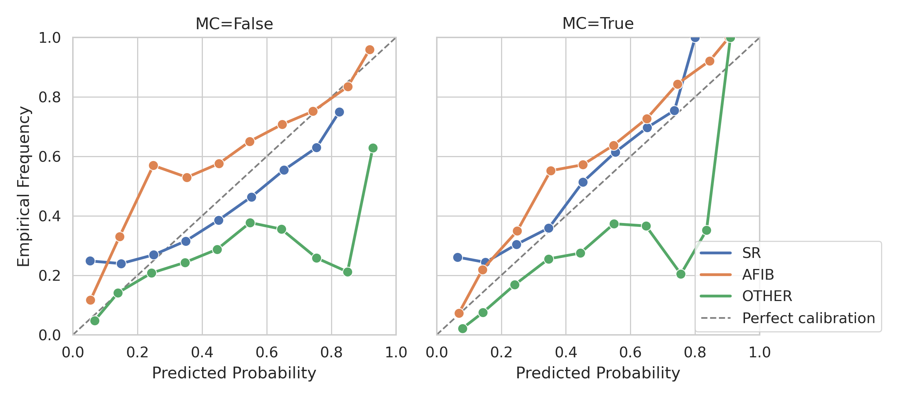
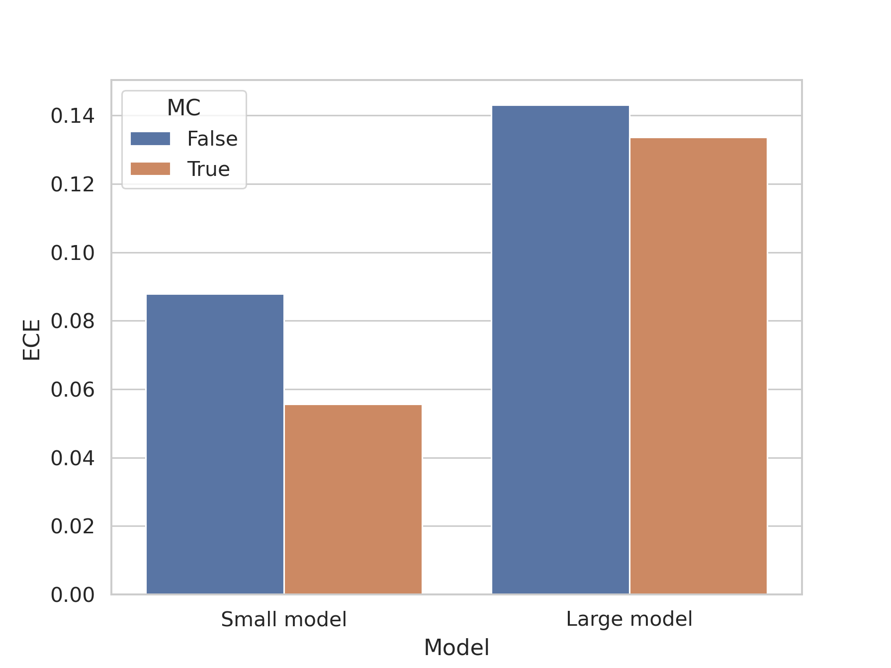

# Monte Carlo Sampling for Classification

Monte Carlo Sampling improves uncertainty estimation and calibration in ECG classification tasks.

This repository contains code to perform Monte Carlo sampling for uncertainty estimation in ECG classification tasks. The implementation is based on the work by [Yarin Gal and Zoubin Ghahramani](https://arxiv.org/pdf/1506.02142).

## News 
This work has been accepted in the European Heart Journal – Digital Health (2025): From Clinic to Couch: An Uncertainty-Aware Deep Learning Approach for ECG Analysis Across Modalities
- 👉 Link to article (to be added)

## Results
### MC-Dropout improves model calibration

### Small models are better calibrated than large models
